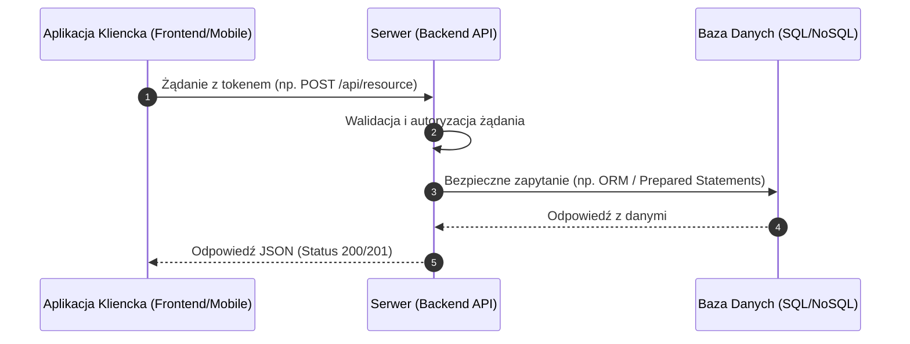

# SZABLON DOKUMENTACJI PREMIUM (MASTER README BLUEPRINT)
> **Oficjalny, ujednolicony standard dokumentacji technicznej i biznesowej dla projektów programistycznych. Niniejszy plik służy jako wzorzec (blueprint) oraz zawiera instrukcję tworzenia spójnych plików README i stosowania sygnatur w kodzie.**

---

[](https://twoj-framework.com)
[](https://en.wikipedia.org/wiki/Proprietary_software)
[](https://twoj-jezyk.com)

---

## 🗂️ INSTRUKCJA: Struktura Nagłówków i Podpisów (Signatures)

Każdy nowo tworzony lub aktualizowany plik `README.md` w ekosystemie projektowym musi rozpoczynać się od ujednoliconego podpisu. Zapobiega to rozbieżnościom i od razu pozycjonuje kod jako produkt klasy premium.

### 1. Budowa podpisu początkowego
Podpis składa się z czterech sekcji:
1.  **Tytuł Główny (`#`)**: Pełna nazwa projektu/aplikacji oraz po myślniku zwięzły podtytuł biznesowy (np. `Acme ERP - Moduł Finansowy`).
2.  **Opis Wyróżniony (`> **...**`)**: Dokładne jedno lub dwuzdaniowe wyjaśnienie roli techniczno-biznesowej projektu, napisane pogrubioną czcionką wewnątrz bloku cytatu.
3.  **Linia oddzielająca (`---`)**: Pozioma kreska oddzielająca wprowadzenie od reszty dokumentu.
4.  **Tarcze statusu (Badges)**: Zestaw minimum trzech kolorowych tarcz graficznych informujących o głównym frameworku, typie licencji oraz języku/środowisku uruchomieniowym.

#### Szablon Kodu Podpisu (Skopiuj i uzupełnij):
```markdown
# [NAZWA PROJEKTU] - [PODTYTUŁ BIZNESOWY]
> **[JEDNO/DWUZDANIOWY POGRUBIONY OPIS ROLI PROJEKTU I JEGO GŁÓWNYCH KORZYŚCI BIZNESOWYCH]**

---

[]()
[]()
[]()
```

### 2. Budowa nagłówka autorskiego dla plików źródłowych

Wszystkie kluczowe pliki źródłowe w projekcie muszą posiadać znormalizowany nagłówek autorski chroniący własność intelektualną. W zależności od języka programowania i typu pliku, należy użyć odpowiedniej składni:

#### Pliki z komentarzami blokowymi (PHP, TS, JS, CSS, Java, C#, C++)
```javascript
/**
 * @project [nazwa_projektu]
 * @file [nazwa_pliku]
 * @author [Imię i Nazwisko / Nazwa Firmy]
 * @copyright © [Rok] [Imię i Nazwisko / Nazwa Firmy]. Wszelkie prawa zastrzeżone.
 * @license [Nazwa Licencji, np. Custom Proprietary License / MIT]
 *
 * Ten plik jest częścią oprogramowania [pelna_nazwa_projektu].
 * Licencja na użycie, kopiowanie i modyfikację tego pliku
 * została udzielona wyłącznie w ramach warunków licencyjnych określonych
 * w umowie licencyjnej dostarczonej wraz z produktem.
 *
 * Uwaga: Naruszenie praw autorskich i warunków licencji będzie skutkować
 * podjęciem odpowiednich kroków prawnych.
 */
```

#### Pliki skryptowe (Python, Ruby, Bash, YAML)
```python
# @project [nazwa_projektu]
# @file [nazwa_pliku]
# @author [Imię i Nazwisko / Nazwa Firmy]
# @copyright © [Rok] [Imię i Nazwisko / Nazwa Firmy]. Wszelkie prawa zastrzeżone.
# @license [Nazwa Licencji]
#
# Ten plik jest częścią oprogramowania [pelna_nazwa_projektu].
# ... [reszta noty licencyjnej]
```

#### Szablony i pliki znaczników (HTML, XML, Vue, Svelte)
```html
<!--
 - @project [nazwa_projektu]
 - @file [nazwa_pliku]
 - @author [Imię i Nazwisko / Nazwa Firmy]
 - @copyright © [Rok] [Imię i Nazwisko / Nazwa Firmy]. Wszelkie prawa zastrzeżone.
 - @license [Nazwa Licencji]
 -->
```

### 3. Casing pliku (Wielkość liter w systemach operacyjnych)
> [!IMPORTANT]
> **Ze względu na brak rozróżniania wielkości liter (case-insensitivity) w systemach Windows, a ścisłe rozróżnianie w środowiskach Linux/Docker, zawsze pilnuj wielkości liter w nazwach plików!**
> *   Plik dokumentacji **musi** nazywać się `README.md` (wszystkie litery wielkie).
> *   Przed nadpisaniem pliku upewnij się (np. przez `ls -l`), jak plik aktualnie nazywa się w repozytorium gita. Zmiana wielkości liter w systemie Windows często nie jest poprawnie wykrywana przez kontrolę wersji bez specjalnych flag.

### 4. Dobre praktyki i Scaffolding (Inicjalizacja)

> [!IMPORTANT]
> **Bezpieczeństwo Środowiska i Konfiguracji**:
> *   **NIGDY** nie commituj do repozytorium plików z hasłami (np. `.env`, `credentials.json`).
> *   W każdym nowym projekcie zawsze twórz plik `.env.example` lub `.env.template` zawierający strukturę zmiennych środowiskowych z pustymi lub bezpiecznymi (lokalnymi) wartościami.
> *   Dbaj o poprawny i kompletny plik `.gitignore` dostosowany do stacku technologicznego (wykluczający foldery takie jak `node_modules/`, `vendor/`, `__pycache__/`, pliki konfiguracyjne IDE itp.).
>
> **Procedura Startowa (Scaffolding)**:
> Przy rozpoczynaniu projektu w pierwszej kolejności stwórz solidną ramę: plik `README.md`, konfigurację linterów/formatterów (np. `.prettierrc`, `.eslintrc`), strukturę pustych katalogów oraz minimalny plik wejściowy (np. `index.js`, `main.py`, `App.vue`). Dopiero po wdrożeniu i zatwierdzeniu tej bazy należy implementować logikę biznesową.

---

## 📐 UNIWERSALNY SZABLON STRUKTURY PLIKU `README.md`

Poniżej znajduje się kompletny, ustrukturyzowany spis sekcji, które **muszą** znaleźć się w każdym pliku dokumentacji projektu.

### Sekcja I: 📖 O projekcie
Wyczerpujący opis biznesowy i funkcjonalny aplikacji/systemu. Opisujemy tutaj:
*   Dla kogo jest przeznaczony (Docelowa grupa odbiorców).
*   Jaki problem rozwiązuje i jakie korzyści biznesowe przynosi.
*   Główny pomysł (High-level concept) stojący za jego działaniem.

---

### Sekcja II: ✨ Główne cechy i funkcjonalności
Podział cech technicznych na mniejsze, czytelne bloki z użyciem pogrubionych słów kluczowych.
*   **[Nazwa Funkcji I]**: Zwięzły opis z perspektywy wartości, np. "Architektura Real-Time", "Asynchroniczne przetwarzanie kolejek".
*   **[Nazwa Funkcji II]**: Opis techniczny, np. "Bezstanowe autoryzowanie tokenami JWT".

---

### Sekcja III: 🏗️ Architektura i Przepływ danych (Diagramy Mermaid)
Każdy zaawansowany projekt musi posiadać graficzny diagram (sekwencji, przepływu lub architektury) wykonany w formacie **Mermaid**, obrazujący cykl życia żądania:



---

### Sekcja IV: 🏗️ Modele Danych (Opcjonalnie)
Prezentacja kluczowych encji/struktur danych w formie tabeli Markdown. Jeśli projekt opiera się na złożonej bazie danych, warto opisać główne tabele:

#### Encja / Tabela: `users`
| Kolumna / Pole | Typ | Indeks/Relacja | Opis działania i rola w systemie |
| :--- | :---: | :---: | :--- |
| `id` | UUID/INT | Primary Key | Unikalny identyfikator użytkownika. |
| `email` | VARCHAR | Unique | Adres e-mail używany do logowania. |
| `password_hash` | VARCHAR | - | Zaszyfrowane hasło (np. bcrypt/Argon2). |

---

### Sekcja V: 📂 Struktura katalogów
Kompletne drzewo kluczowych plików projektu (z wykluczeniem plików roboczych i zależności). Każdy ważny folder i plik powinien posiadać zwięzły opis w komentarzu po znaku `#`:

```bash
nazwa_projektu/
├── src/
│   ├── controllers/         # Kontrolery obsługujące żądania (Endpointy)
│   ├── models/              # Definicje encji / Schematy bazy danych
│   ├── services/            # Główna logika biznesowa i integracje zewnętrzne
│   ├── utils/               # Funkcje pomocnicze, helpery
│   └── index.js             # Główny plik wejściowy (Entry point) aplikacji
├── tests/
│   ├── unit/                # Testy jednostkowe
│   └── integration/         # Testy integracyjne i E2E
├── docs/                    # Rozszerzona dokumentacja (OpenAPI/Swagger, notatki)
├── .env.example             # Szablon zmiennych środowiskowych
├── .gitignore               # Lista ignorowanych plików w Git
└── README.md                # Ten plik
```

---

### Sekcja VI: 🔒 Bezpieczeństwo i Optymalizacja
Szczegółowy opis zabezpieczeń i decyzji architektonicznych wdrożonych w kodzie:
1.  **Ochrona danych wejściowych**: Zastosowanie walidatorów (np. Zod, Joi, DTO) oraz uodpornienie na SQL/NoSQL Injection (ORM, Prepared Statements).
2.  **Zarządzanie Tożsamością**: Standardy bezpieczeństwa sesji (np. HTTP-only cookies, krótkotrwałe tokeny JWT, mechanizmy Refresh).
3.  **Wydajność (Performance)**: Strategie cache'owania (Redis/Memcached), paginacja danych, indexowanie w bazie danych.

---

### Sekcja VII: 🚀 Instalacja i Uruchomienie (Krok po Kroku)
Instrukcja pozwalająca innemu deweloperowi na sklonowanie i uruchomienie projektu z "czystym kontem":
1.  Klonowanie repozytorium.
2.  Tworzenie pliku `.env` na podstawie `.env.example`.
3.  Instalacja zależności (np. `npm install`, `pip install`, `composer install`).
4.  Inicjalizacja/Migracje bazy danych.
5.  Uruchomienie serwera deweloperskiego (lub środowiska np. `docker-compose up`).

> [!TIP]
> **Zmienne Środowiskowe**:
> Pamiętaj, aby przed uruchomieniem zaktualizować w pliku `.env` zmienne takie jak `DB_HOST`, `API_KEY` odpowiadające Twojemu lokalnemu środowisku.

---

### Sekcja VIII: 📝 Licencja i Prawa Autorskie
Wbudowany blok określający zasady dystrybucji kodu (Zmień w zależności od typu licencji: MIT, GPL, Proprietary):

> [!WARNING]
> **Oprogramowanie objęte jest licencją [Nazwa Licencji, np. Proprietary].**

Wszystkie prawa zastrzeżone. Kod źródłowy jest własnością:
*   **Autor/Organizacja**: [Nazwa Firmy / Imię i Nazwisko]
*   **Copyright**: © [Rok].

Bez odpowiedniej licencji lub uprzedniej, pisemnej zgody zabrania się kopiowania, modyfikacji i redystrybucji.

---
---

## 🎮 PRZYKŁAD WDROŻENIA: Projekt `AuthService API`

*Poniżej znajduje się wzorcowe zastosowanie powyższego szablonu dla przykładowego mikroserwisu autoryzacyjnego.*

# Acme Auth Service - Centralny Mikroserwis Tożsamości
> **Bezstanowy, wysokowydajny mikroserwis w Node.js/Express, służący do scentralizowanego zarządzania użytkownikami, uwierzytelniania (JWT) i nadawania uprawnień w architekturze rozproszonej.**

---

[](https://expressjs.com/)
[]()
[]()

## 📖 O projekcie

**Acme Auth Service** to rdzeniowy komponent systemu rozproszonego firmy Acme. Działa jako Single Source of Truth (SSOT) dla tożsamości użytkowników we wszystkich aplikacjach pobocznych. 

Zamiast implementować logowanie w każdej nowej aplikacji, systemy satelickie komunikują się z tym API, aby zweryfikować użytkownika. Serwis generuje kryptograficznie zabezpieczone tokeny JWT (Access & Refresh Tokens), które są następnie wykorzystywane do bezstanowej autoryzacji w całym ekosystemie. Rozwiązuje to problem redundancji kodu i centralizuje politykę bezpieczeństwa (w tym wymuszanie 2FA oraz resetowanie haseł).

## ✨ Główne cechy i funkcjonalności

*   **Logowanie z mechanizmem Refresh Token**: Bezpieczny obieg tokenów - krótkotrwały token dostępowy (`15m`) oraz długotrwały token odświeżający trzymany w bezpiecznym ciasteczku `HttpOnly`.
*   **RBAC (Role-Based Access Control)**: Zarządzanie uprawnieniami za pomocą dynamicznych ról (Admin, User, Manager) zakodowanych bezpośrednio w payloadzie tokena JWT.
*   **Zabezpieczenie przed Brute-Force**: Zaimplementowany mechanizm Rate Limitingu przy użyciu bazy Redis (maksymalnie 5 błędnych prób logowania z jednego IP na minutę).