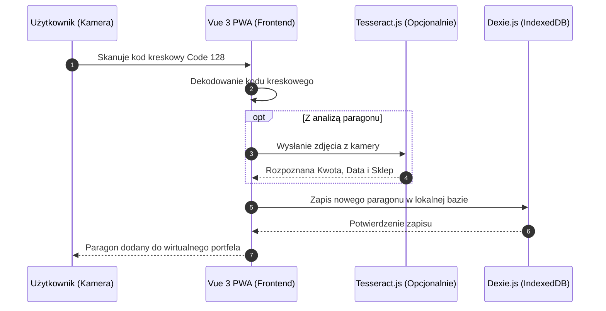

# YIN-PortfelKaucyjny - PWA dla Kodów Rabinowych i Kaucji
> **Autonomiczna, progresywna aplikacja webowa (PWA) działająca w trybie offline-first, przeznaczona do gromadzenia, zarządzania i wymiany kodów z recyklomatów (kaucja za butelki).**

---

[](https://vuejs.org/)
[]()
[]()

## 📖 O projekcie

**Portfel Kaucyjny** to innowacyjna aplikacja mobilna PWA zaprojektowana specjalnie do zarządzania kodami rabatowymi z recyklomatów wydających kaucję za butelki. 
Głównym problemem, który rozwiązuje, jest fizyczne zagubienie papierowych paragonów kaucyjnych lub ich przedawnienie. Aplikacja pozwala na zeskanowanie kodu kreskowego (Code 128), automatyczne przypisanie mu danych sklepu, daty ważności i kwoty, a następnie przechowywanie ich w formie cyfrowej w wirtualnym portfelu. W Fazie 2 aplikacja przeistacza się w platformę typu Marketplace z mechanizmem Escrow dla wymiany punktów pomiędzy anonimowymi użytkownikami.

## ✨ Główne cechy i funkcjonalności

*   **PWA Offline-First (Faza 1)**: Działanie bez konieczności połączenia z internetem. Pełne gromadzenie danych lokalnie za pomocą bazy IndexedDB (Dexie.js).
*   **Wbudowany Skaner Kodów**: Odczyt kodów Code 128 bezpośrednio z tylnej kamery smartfona z wykorzystaniem zoptymalizowanego obszaru skanowania (html5-qrcode).
*   **System Powiadomień o Terminach**: Wyraźne alerty (kolor czerwony) oznaczające paragony kończące swoją ważność w czasie poniżej 3 dni.
*   **Architektura Modułowa pod API (Faza 2)**: Kod i usługi lokalne zaprojektowane w oparciu o czyste interfejsy do bezproblemowego podłączenia pod docelowy Backend i zapytania Axios/Fetch.

## 🏗️ Architektura i Przepływ danych (Faza 1)



## 🏗️ Modele Danych

#### Encja: `receipts` (Tabela lokalna - Dexie.js)
| Kolumna / Pole | Typ | Indeks/Relacja | Opis działania i rola w systemie |
| :--- | :---: | :---: | :--- |
| `id` | Wzrastający INT | Primary Key | Unikalny identyfikator paragonu lokalnego. |
| `shop_name` | STRING | Index | Nazwa sklepu (np. Biedronka, Lidl). |
| `amount` | FLOAT | - | Wartość kaucji w PLN. |
| `expiration_date` | DATE | Index | Data wygaśnięcia ważności kodu. |
| `barcode` | STRING | Unique | Zeskanowany kod kreskowy (Code 128). |
| `status` | ENUM | - | Status paragonu (aktywny / wykorzystany). |

## 📂 Struktura katalogów

```bash
YIN-PortfelKaucyjny/
├── public/                  # Pliki statyczne, PWA manifest, ikony
├── src/
│   ├── components/          # Komponenty UI (Skaner, Lista Paragonów)
│   ├── views/               # Główne ekrany (Portfel, Dodaj Paragon)
│   ├── services/            # Warstwa dostępu do danych (Dexie.js), OCR
│   ├── store/               # Zarządzanie stanem globalnym (Pinia/Context)
│   ├── utils/               # Funkcje pomocnicze, walidatory, regexy
│   └── main.js              # Główny plik wejściowy (Entry point)
├── .env.example             # Szablon zmiennych środowiskowych
├── .gitignore               # Lista ignorowanych plików w Git
├── README.md                # Ten plik dokumentacji (Master)
└── DOCUMENTATION.md         # Techniczna dokumentacja i rejestr decyzji (ADR)
```

## 🔒 Bezpieczeństwo i Optymalizacja

1.  **Dane Offline i Prywatność**: W Fazie 1 wszystkie dane przetwarzane są całkowicie lokalnie w przeglądarce użytkownika. Brak zewnętrznych calli API.
2.  **Optymalizacja Skanowania (Scan Area)**: Analiza tylko małego, wąskiego fragmentu obszaru wizji kamery minimalizuje obciążenie procesora, co jest krytyczne dla starszych telefonów i PWA.
3.  **Oddzielenie Warstwy Danych**: Repozytoria i CRUD nie uderzają bezpośrednio do instancji bazy IndexedDB w widokach, lecz poprzez abstrakcyjne serwisy przygotowane na migrację do Axios REST API (w Fazie 2).

## 🚀 Instalacja i Uruchomienie (Krok po Kroku)

1. Sklonuj repozytorium: `git clone https://github.com/zm0r4sky/YIN-PortfelKaucyjny.git`
2. Utwórz plik konfiguracyjny `.env` (na bazie `.env.example`, jeśli występuje).
3. Zainstaluj zależności aplikacji: `npm install`
4. Uruchom serwer developerski Vite: `npm run dev`
5. *Hostowane publicznie:* Github Pages jest spięte z gałęzią `main`, build i deployment przebiega automatycznie w Github Actions.

## 📝 Licencja i Prawa Autorskie

> [!WARNING]
> **Oprogramowanie objęte jest licencją CPL (Proprietary).**

Wszystkie prawa zastrzeżone. Kod źródłowy jest własnością:
*   **Autor/Organizacja**: MARIUSZ OPACH
*   **Copyright**: © 2026.

Bez odpowiedniej licencji lub uprzedniej, pisemnej zgody zabrania się kopiowania, modyfikacji i redystrybucji.
